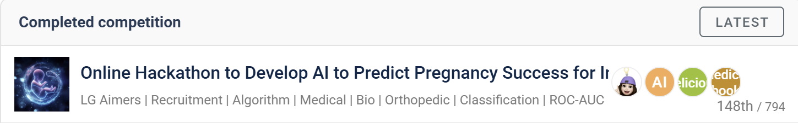
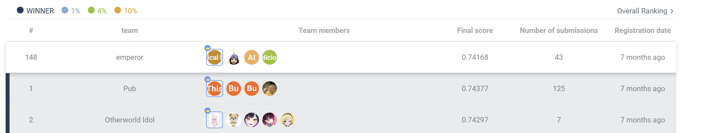

# LG Aimers AI Hackathon – Pregnancy Success Prediction

This repository contains my work from the **LG Aimers AI Hackathon (6th Cohort)**, where our team developed a machine learning model to **predict pregnancy success rates for infertility treatments**.  
We used the **UK HFEA (Human Fertilisation & Embryology Authority)** dataset and evaluated models based on **ROC-AUC**.

---

## 📌 Overview
- **Competition**: LG Aimers AI Hackathon (Data Intelligence 6th Cohort)  
- **Task**: Predict pregnancy success for infertility treatments  
- **Dataset**: Public infertility treatment dataset (HFEA, UK)  
- **Metric**: ROC-AUC (private leaderboard based on 100% of test data)  
- **For EDA & Preprocessing**: Python, Pandas, NumPy, Matplotlib, Seaborn  
- **For Modeling**: Scikit-learn (RandomForest), TensorFlow/Keras (MLP)

---

## 🏆 Key Achievements
- Ranked **148th out of 794 teams (Top 19%)**  
- Final Private ROC-AUC: **0.74168** (Winner: 0.74377)  
- Score gap from top teams was minimal (<0.002 difference)  

---

## 👩‍💻 My Contributions
- Conducted **exploratory data analysis (EDA)** to identify key features influencing pregnancy outcomes  
- Built **data preprocessing pipeline**: missing value handling, categorical encoding, normalization  
- Implemented baseline ML models (RandomForest, MLP) and compared performance  
- Proposed future improvements for advanced modeling and feature engineering

---

## 📊 Results

### Leaderboard Placement
 
  

*Ranked 148th out of 794 teams (Top 19%)*  

### Certificate
  
*Certificate of Completion – LG Aimers AI Hackathon 6th Cohort*  

---

## 🚀 How to Run
Clone the repository and install dependencies:
```bash
git clone https://github.com/username/LG-Aimers-AI-Hackathon-Pregnancy-Success-Prediction.git
cd LG-Aimers-AI-Hackathon-Pregnancy-Success-Prediction
pip install -r requirements.txt
